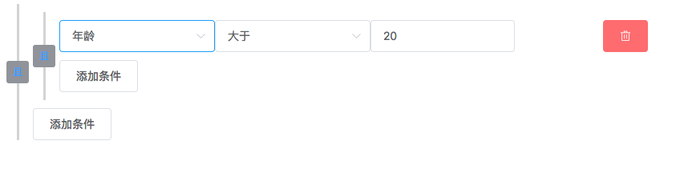

# vue-condition-relation

⚠️  主要提供思路，不建议直接使用（可以根据业务需求修改）

#### vue组件————条件关系选择



目前只有两层关系

## 依赖与安装

使用了`element-ui`组件，需要全局引入（`Vue.use(ElementUI)` 以及css）。  
具体见[Elment-ui](http://element-cn.eleme.io/#/zh-CN/component/quickstart)。

## Demo演示

`npm run serve`

## 数据结构

#### 属性

|参数|说明|类型|是否必填|
|---|----|---|-------|
|options|可以选择选项|options Object|是|
|conditions|当前条件值|conditions Object|否|

```javascript
// options Object结构
// 其中keyOptions对应第一个下拉
// 通过第一个下拉的值，拿到对应relationOptions和valueInputs。
// valueInput不同的type对应不同的值选择
options: {
  keyOptions: [{
    label: '性别',
    value: 'gender'
  }, {
    label: '年龄',
    value: 'age'
  }],
  relationOptions: {
    gender: [{
      label: '是',
      value: '='
    }, {
      label: '不是',
      value: '!='
    }],
    age: [{
      label: '等于',
      value: '='
    }, {
      label: '大于',
      value: '>'
    }, {
      label: '小于',
      value: '<'
    }]
  },
  valueInputs: {
    gender: {
      type: 1,
      options: [{
        label: '男',
        value: '0'
      }, {
        label: '女',
        value: '1'
      }]
    },
    age: {
      type: 3
    }
}
```
|type|value|
|----|-----|
|0|文本|
|1|单选下拉|
|2|多选下拉|
|3|数值比较|
|4|时间选择|
|5|时间段选择|
|6|级联下拉|

```javascript
// conditions Object结构
// describe表示关系的值，relation表示条件的值，value表示结果的值。
conditions: {
  group: [{
    group: [{
      describe: '',
      relation: '',
      value: ''
    }],
    relation: 'and'
  }],
  relation: 'and'
}
```

#### 需要改进

1. `options`的结构，目前通过`keyOptions`的`value`去确定`relationOptions`和`inputOptions`的方式并不好。

2. `conditions`的修改目前是通过`JavaScript`中对象属性的修改实现的，理想下这里应该通过事件实现。